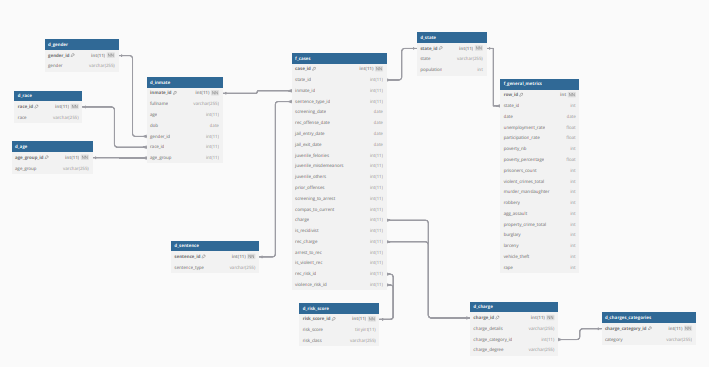
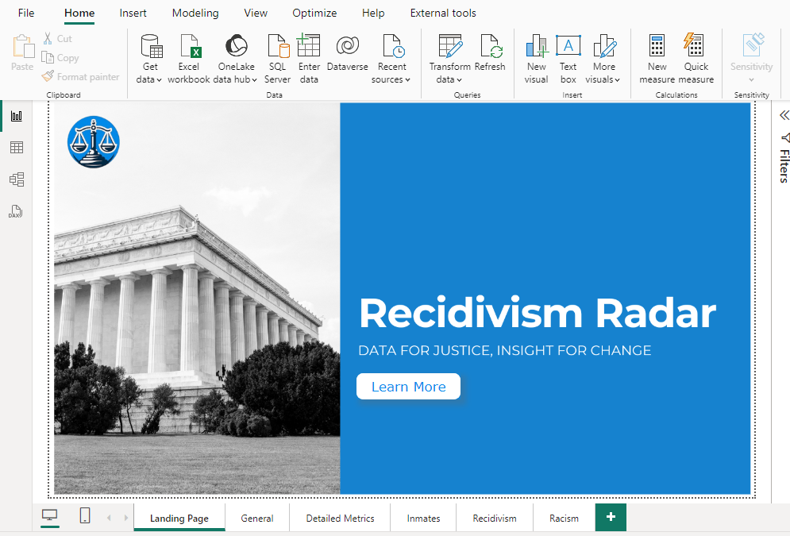
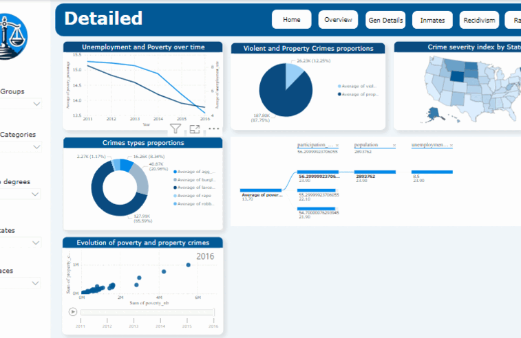
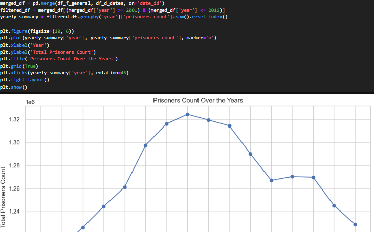
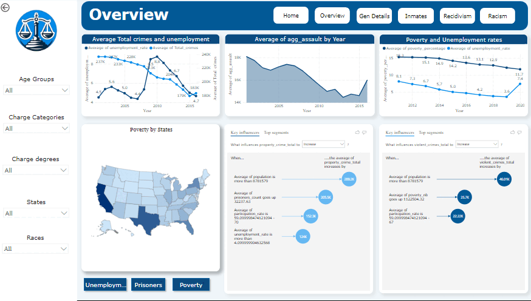

<br><br>

<!-- project philosophy -->


> A data project based on Recidivism and Crimes records to uncover its results affected by a set of individual history and public factors.
>
>  Recidivism Radar, leverages advanced data analytics to understand and predict patterns of recidivism within the criminal justice system. By integrating comprehensive datasets encompassing socioeconomics, poverty, population demographics, and crime statistics, it aims to uncover critical insights that influence recidivism rates over time.

### User Stories
- As a researcher, I want to analyze recidivism trends over time, so I can identify patterns and key factors influencing recidivism rates.
- As a policymaker, I want to visualize socioeconomic and demographic data using interactive dashboards, so I can understand the underlying causes of recidivism and inform policy decisions.
- As a law enforcement officer, I want to explore real-time insights on recidivism rates using Power BI, so I can allocate resources effectively and reduce repeat offenses.

<br><br>
<!-- Tech stack -->


###  Recidivism Radar is built using the following technologies:

- Python: Python is the core programming language used for data analysis, machine learning, and building predictive models. It allows us to efficiently process and analyze large datasets related to recidivism, socioeconomics, and crime.
- SQL: SQL is used to manage and query the data warehouse, enabling the extraction of relevant data such as demographic information, crime statistics, and socioeconomic factors for further analysis and reporting.
- Power BI: Power BI is employed for data visualization and reporting. It provides interactive dashboards that display time series trends and insights into recidivism rates, allowing stakeholders to explore the data dynamically.


<br><br>


<!-- Data warehouse Design -->


###  Architecting Data Excellence: Innovative Data warehouse Design Strategies:

- 


<br><br>


<!-- Implementation -->


### Admin Screens (Web)
| Landing page  | Dashboard details 
| ---| ---|
|  | |
| Time series  | Model prediction 
|  |  
<br><br>


<!-- Prompt Engineering -->


###  Mastering AI Interaction: Unveiling the Power of Prompt Engineering:

- This project leverages machine learning techniques to optimize the analysis of recidivism patterns. By curating and preparing detailed datasets, such as inmate demographics, offense history, and risk scores, we develop predictive models to identify potential recidivism factors.

<br><br>


<!-- Data Validation -->


###  Precision in Loading: Harnessing the Power of Data Validation:

- This project employs rigorous data validation methodology to ensure the integrity and consistency of the data. By applying some python queries evaluating data types in the warehouse, then checking for the presence of all the intended data, we can ensure a successful ETL process.


<br><br>


<!-- How to run -->


> To set up Recidivism Radar locally, follow these steps:

### Prerequisites

This is an example of how to list things you need to use the software and how to install them.
* pip
  ```sh
   pip install pandas
   pip install numpy
   pip install scikit-learn
   pip install mlflow
   pip install sqlalchemy
   pip install flask

  ```
    

### Installation

_Below is an example of how you can instruct your audience on installing and setting up your app. This template doesn't rely on any external dependencies or services._


1. Clone the repo
   git clone [github](https://github.com/SalehMk0/Recidivism-Radar.git)
2. Install pip packages
   ```sh
   pip install -r requirements.txt
   ```
3. Run the sql file dwh.sql to initialize the data warehouse.

4. Run the cleaning files.
5. Run the Load file to load the data into the data warehouse.
6. Run the timeseries analysis file to explore the plots.
7. Run the Model file to set up the model and make predictions.
8. Run the mlflow server and the python flask app. 
9. Open the browser to view the page and make a prediction.
10. Download the <a href="https://www.microsoft.com/en-us/download/details.aspx?id=58494">Power BI Desktop</a>
11. Open the analysis file (Power BI) to see beautiful dynamic visuals.
 


Now, you should be able to explore Recidivism Radar locally.
